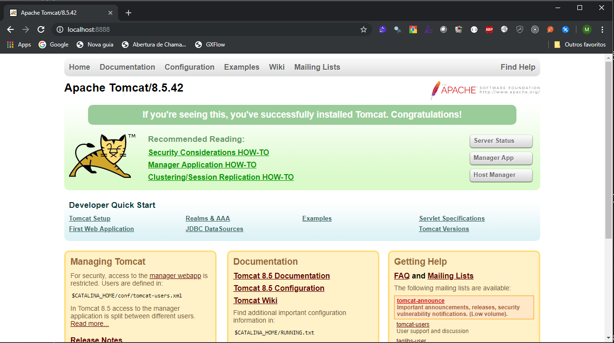

# Atividade 02

## Docker CLI

Nesta atividade vamos explorar alguns comandos básicos do Docker CLI, inicialmente vamos executar o comando [docker pull](https://docs.docker.com/engine/reference/commandline/pull/) para executar o download da imagem para o nosso computador. Para isso iremos executar o comando `docker pull tomcat`.

```bash
C:\>docker pull tomcat
Using default tag: latest
latest: Pulling from library/tomcat
6f2f362378c5: Pull complete
494c27a8a6b8: Pull complete
7596bb83081b: Pull complete
372744b62d49: Pull complete
fb72767f9beb: Pull complete
3fe571af508a: Pull complete
3e6725074325: Pull complete
9ffd5dadda90: Pull complete
4e051c2969b0: Pull complete
b326a8316680: Pull complete
Digest: sha256:cea26a23e1ebdbebdddde1e02a10e655b0b386d8de6002301a037a08be87a12f
Status: Downloaded newer image for tomcat:latest
```

O Docker irá realizar o download da imagem do Tomcat para o computador e descompactar a imagem. 

Para listar as imagens que existem localmente existe o comando [docker images](https://docs.docker.com/engine/reference/commandline/images/), execute ele na linha de comando.

```bash
C:\>docker images
REPOSITORY          TAG                 IMAGE ID            CREATED             SIZE
tomcat              latest              5377fd8533c3        2 weeks ago         506MB
hello-world         latest              fce289e99eb9        6 months ago        1.84kB
```
São apresentados todas as imagens que foram baixadas para o computador.

Para executar um contêiner existe o comando [docker run](https://docs.docker.com/engine/reference/commandline/run/), vamos executar a imagem do Tomcat com o a comando `docker run -it -p 8888:8080 tomcat`. O parâmetro `-it` faz o contêiner executar em modo interativo e o parâmetro `-p`  faz o mapeamento da porta do contêiner em uma porta no host, neste caso mapeando a porta 8080 do contêiner para a porta 8888 do computador, dessa forma o Tomcat estará visivel pela porta 8888. 

Abra o browser e digite a seguinte Url http://localhost:8888/ para acessar o Tomcat.




Agora abra outra tela de linha de comando e execute o `docker ps`.

```bash
C:\>docker ps
CONTAINER ID        IMAGE               COMMAND             CREATED              STATUS              PORTS                    NAMES
fb1bb71d27e2        tomcat              "catalina.sh run"   About a minute ago   Up About a minute   0.0.0.0:8888->8080/tcp   xenodochial_elion
```


