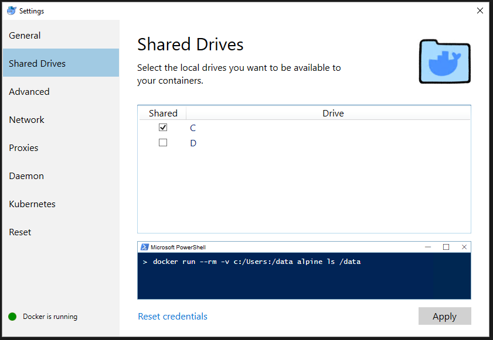

# Atividade 04

## Docker Volume


Para mapear uma pasta do Windows para um volume do Docker, inicialmente é necessário habilitar o Shared Drive no Docker Desktop.
Na opção Shared Drive, selecione o drive C e clique em Apply. Será solicitado a senha do administrador para liberar o acesso do Docker Host ao drive C.



Agora vamos executar o comando `docker run` agora com o parâmetro `-v` para mapear a pasta C:\HandsOnDocker do Windows para a pasta /data do Linux Alpine, também será passado o comando `ls` para listar os arquivos da pasta data.

```bash
C:\HandsOnDocker>docker run -v c:/HandsOnDocker:/data alpine ls /data
Unable to find image 'alpine:latest' locally
latest: Pulling from library/alpine
921b31ab772b: Pull complete
Digest: sha256:ca1c944a4f8486a153024d9965aafbe24f5723c1d5c02f4964c045a16d19dc54
Status: Downloaded newer image for alpine:latest
Dockerfile
SampleWebApp.war
```
Vemos que o Docker executou mapeou a pasta corretamente e mostrou o conteúdo.

Agora vamos executar criar o contêiner usando o parâmetro `-it` para podemos executar comandos no bash do Linux. Após o contêiner subir execute o comando ls para listar as pastas.

```bash
C:\HandsOnDocker>docker run -it -v c:/HandsOnDocker:/data alpine
/ # ls
bin    dev    home   media  opt    root   sbin   sys    usr
data   etc    lib    mnt    proc   run    srv    tmp    var
/ #
```

Execute o comando `cd data` para entrar na pasta. Agora vamos criar uma aquivo texto usando a instrução `cat > teste.txt`. Digite alguma coisa e depois aperte CTRL + C para sair do arquivo. Execute o comando `ls` para listar os arquivos.

```bash
/ # cd data
/data # cat > teste.txt
texto de teste^C
/data # ls
Dockerfile        SampleWebApp.war  teste.txt
/data #
```

Verifique se na pasta C:\HandsOnDocker aparece o arquivo teste.txt.


